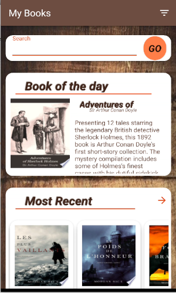
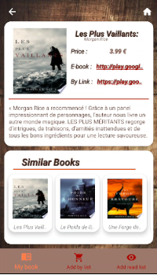
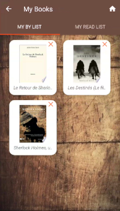

# My Books

"My Books" est une application Android open source qui utilise l'API Book de google.

  

My Books vous permets de faire des recherche dans la bibliothèque de Google,
d'afficher les détails d'un livre et de l'ajouter dans sa liste d'achats ou de lecture,

 
 

